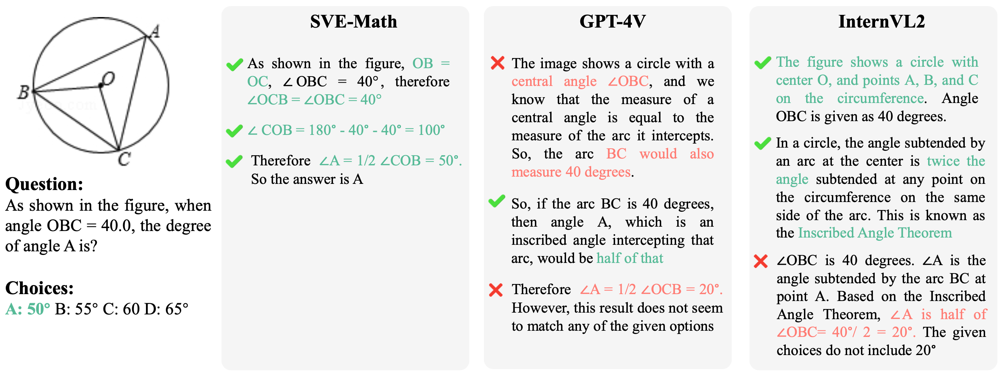

#  Open Eyes, Then Reason: Fine-grained Visual Mathematical Understanding in MLLMs (SVE-Math)
Implementation of the paper Open Eyes, Then Reason: Fine-grained Visual Mathematical Understanding in MLLMs
## 🔔 News

- 🎉 **[2024-12-10]:** Released the code for SVE-Math-Qwen2.5-7B.
## ✨ TODO
- [x] Release the evaluation code for MultiModal Math Benchmarks.
- [ ] Release model weights of SVE-Math-7B, SVE-Math-Deepseek-7B and SVE-Math-Qwen2.5-7B.
- [ ] Release the training code and scripts of GeoGLIP.
## 📖 Introduction

This paper introduces SVE-Math, a novel approach to solving visual mathematical reasoning tasks by integrating fine-grained visual perception into Multimodal Large Language Models (MLLMs). Traditional MLLMs often struggle with visual reasoning due to their limited ability to recognize and interpret geometric primitives and spatial locations. SVE-Math is the first to design GeoGLIP (Geometric-Grounded Language-Image Pre-training), a lightweight, geometry-aware visual model with multitask learning capabilities, including **shape grounding, junction detection, and boundary detection**. GeoGLIP integrates seamlessly with diverse LLM backbones without requiring modifications to their reasoning components. Our framework aims to bridge the gap between visual perception and logical reasoning for mathematical problems, providing a robust system capable of addressing mathematical challenges through fine-grained visual perception.

---

## 🚀 Features

- **Lightweight and Modular Design**: Seamlessly integrates into existing LLMs (e.g., [LLaMA2](https://huggingface.co/docs/transformers/model_doc/llama2), [Qwen2.5-Math-Instruct](https://huggingface.co/Qwen/Qwen2.5-Math-7B-Instruct) and [DeepSeek-Math-Instruct](https://huggingface.co/deepseek-ai/deepseek-math-7b-instruct)), requiring minimal computational overhead.
- **Fine-Grained Visual Understanding**: GeoGLIP is trained on multiple tasks using box- and pixel-level supervision to ensure precise perception of geometric primitives and visual entities.
- **Mind’s Eye**:  Unlike previous works that focus on constructing large-scale mathematical visual instruction datasets for training MLLMs, our approach emphasizes visual-centric tasks. It complements reasoning-focused methods by addressing the gap in visual perception—an area that has received less attention in existing research.
- **State-of-the-Art Results among 7B counterparts**: SVE-Math-Qwen2.5-7B outperforms other 7B models by 12\% on MathVerse and is compatible with GPT-4V on MathVista (50.4\% vs. 49.9\%). Despite being trained on smaller datasets (Geo170K), our method matches the performance of models trained on significantly larger datasets, evaluated on GeoQA (79.6\%). 

---
## 📊 Case studies
<p align="center">
  
  
</p>

## 📦 Installation
* Install Packages
```
cd SVE-Math
conda create -n SVEMath python=3.10 -y
conda activate SVEMath
pip install -e .
```
* Enable Deepspeed
```
pip install deepspeed==0.12.6
```

## 📖 Data Preparation
Download datasets to folder ```./playground``` 

Mathematical visual instruction datasets we used for train including [Geo170K](https://huggingface.co/datasets/Luckyjhg/Geo170K/tree/main), [MathV360K](https://huggingface.co/datasets/Zhiqiang007/MathV360K)

Dataset we used for evaluation including [MathVista](https://github.com/lupantech/MathVista), [MathVerse](https://huggingface.co/datasets/AI4Math/MathVerse), GeoQA.

Place the data under playground. Here is the data structure:
```
playground/
├── data/
│   ├── Geo170K/
│   │   ├── data/
│   │   ├── images/
│   │   ├── alignment.json
│   │   ├── qa_tuning.json
│   ├── test_question.jsonl
│   ├── test_answers.jsonl
├── MathV360K/
│   ├── data_images/
│   ├── train_samples_all_tuning.json
├── MathVerse/
│   ├── images/
│   ├── testmini.json
├── MathVista/
│   ├── data/
│   │   ├── images/
│   │   ├── query.json
│   │   ├── testmini.json
```
## 🌟 Training 
- **MathV360K**

  Run full-finetuning:

    ```sh run_math360k.sh```

- **Geo170K**
1. First Stage Alignment: This stage enables the model to better interpret the content of geometric figures.
   
   ```bash scripts/run_alignment.sh```
2. Second Stage Instruction Tuning: This stage equips the model with stronger ability for solving geometry problems.
   
   ```bash scripts/run_alignment.sh```

## 🔮 Evaluations 
- **MathVista**
  
Inference

```bash eval_mathvista/scripts/infer.sh```

Extract answer (Set your api key in the file first)

```bash eval_mathvista/scripts/extract_ans.sh```

Evaluation

```bash eval_mathvista/scripts/eval_score.sh```
- **MathVerse**

Batch Inference

```bash eval_mathverse/scripts/batch_infer.sh```

Evaluation

```bash eval_mathverse/scripts/eval.sh```
- **GeoQA**

Refer to [G-LLaVa](https://github.com/pipilurj/G-LLaVA/tree/main)
## 🧑‍💻 Acknowledgments
Special thanks to our collaborators and contributors for their invaluable support in improving the codebase and refining our methods.

[G-LLaVa](https://github.com/pipilurj/G-LLaVA/tree/main): the codebase we built upon. Thanks for their great work!

If you find our code and dataset helpful to your research, please consider citing us with this BibTeX:
```
@misc{,
      title={Open Eyes, Then Reason: Fine-grained Visual Mathematical Understanding in MLLMs}, 
      author={Shan Zhang, Aotian Chen, Yanpeng Sun, Jindong Gu, Yi-Yu Zheng, Piotr Koniusz, Kai Zou, Anton van den Hengel, Yuan Xue},
      year={2024},
      eprint={...},
      archivePrefix={arXiv},
      primaryClass={cs.CL}
}
```
